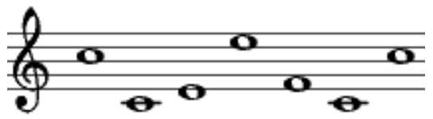

## はじめに

UofTCTF 2024 に sayonara で参加して94位でした．1200チームいたので良い順位です，成長を感じる！

今回はチームメンバーの予定が揃わず２人で参加していました．終了間際に遅れて１人が参加し，点を入れてくれました．

個人的には初めて楕円曲線の問題にチャレンジしました．結果的に解けたので嬉しいのですが，使った攻撃方法のアルゴリズムなどは全然わかっていないので要復習です．

それと新年早々にこれまで writeup を書いてたブログがおかしくなったので作り直しました．しかも，バックアップを取り忘れたのでこれまでの writeupは消滅しました笑．

## repeat (100pt)

### source

gen.py

```python
import os
import secrets

flag = "REDACATED"
xor_key = secrets.token_bytes(8)

def xor(message, key):
    return bytes([message[i] ^ key[i % len(key)] for i in range(len(message))])

encrypted_flag = xor(flag.encode(), xor_key).hex()

with open("flag.enc", "w") as f:
    f.write("Flag: "+encrypted_flag)
```

flag.enc
```
Flag: 982a9290d6d4bf88957586bbdcda8681de33c796c691bb9fde1a83d582c886988375838aead0e8c7dc2bc3d7cd97a4
```

### discription
flag を gen.py で暗号化したものが flag.enc である．

ランダムな8bytesの鍵を生成し，それを用いて1bytesずつ xor を取ることで暗号化している．

フラグフォーマットより平文の最初の8bytesは UofTCTF{ となっているから，これと暗号文の最初の8bytesを xor 関数に入れれば鍵が出力される．

ただ，welcome問題で UofTCTF{} が今回のCTFのフラグフォーマットだとアナウンスがあったのに，この問題では uoftctf{} でした．コードは正しいはずなのにフラグが出なくて１時間位格闘してました．．．フラグフォーマットは大文字小文字含めて統一するか，フォーマットが変わるなら問題文に書いてほしかった（他の問題はなぜか書いてた）．

### solver

```python
encrypted_flag = "982a9290d6d4bf88957586bbdcda8681de33c796c691bb9fde1a83d582c886988375838aead0e8c7dc2bc3d7cd97a4"

text = "uoftctf{"

def xor(message, key):
    return bytes([message[i] ^ key[i % len(key)] for i in range(len(message))])


key = xor(bytes.fromhex(encrypted_flag),text.encode())[:8]
# -> b'\xedE\xf4\xe4\xb5\xa0\xd9\xf3'

print(key)

flag = xor(bytes.fromhex(encrypted_flag),key)

print(flag)
```

```
uoftctf{x0r_iz_r3v3rs1bl3_w17h_kn0wn_p141n73x7}
```

## Pianoman (324pt)

### source

music_cipher.py

```python
# no secrets for you!
flag = ...

# Prime numbers
p = 151974537061323957822386073908385085419559026351164685426097479266890291010147521691623222013307654711435195917538910433499461592808140930995554881397135856676650008657702221890681556382541341154333619026995004346614954741516470916984007797447848200982844325683748644670322174197570545222141895743221967042369
q = 174984645401233071825665708002522121612485226530706132712010887487642973021704769474826989160974464933559818767568944237124745165979610355867977190192654030573049063822083356316183080709550520634370714336131664619311165756257899116089875225537979520325826655873483634761961805768588413832262117172840398661229
n = p * q

# a public exponent hidden away by Windy's musical talents
e = ...


# Converting the message to an integer
m = int.from_bytes(message.encode(), 'big')

# Encrypting the message: c = m^e mod n
inc_m = pow(message_int, e, n)

print(encrypted_message_int)

```

musical_e.png



output.txt

```
13798492512038760070176175279601263544116956273815547670915057561532348462120753731852024424193899030774938204962799194756105401464136384387458651343975594539877218889319074841918281784494580079814736461158750759327630935335333130007375268812456855987866715978531148043248418247223808114476698088473278808360178546541128684643502788861786419871174570376835894025839847919827231356213726961581598139013383568524808876923469958771740011288404737208217659897319372970291073214528581692244433371304465252501970552162445326313782129351056851978201181794212716520630569898498364053054452320641433167009005762663177324539460
```

### discription

RSA なのに $p,q$ わかってるやん！っていう問題．画像から $e$を推測し，当たっていれば $d$ が求まって復号できる．

楽譜には数字譜と呼ばれるものがあるらしく，それを見ながら与えられた楽譜の表す数を推測した．$e=7029307$ でした．暗号というよりは謎解き．

### solver

```python
from Crypto.Util.number import long_to_bytes

ct = 13798492512038760070176175279601263544116956273815547670915057561532348462120753731852024424193899030774938204962799194756105401464136384387458651343975594539877218889319074841918281784494580079814736461158750759327630935335333130007375268812456855987866715978531148043248418247223808114476698088473278808360178546541128684643502788861786419871174570376835894025839847919827231356213726961581598139013383568524808876923469958771740011288404737208217659897319372970291073214528581692244433371304465252501970552162445326313782129351056851978201181794212716520630569898498364053054452320641433167009005762663177324539460
p = 151974537061323957822386073908385085419559026351164685426097479266890291010147521691623222013307654711435195917538910433499461592808140930995554881397135856676650008657702221890681556382541341154333619026995004346614954741516470916984007797447848200982844325683748644670322174197570545222141895743221967042369
q = 174984645401233071825665708002522121612485226530706132712010887487642973021704769474826989160974464933559818767568944237124745165979610355867977190192654030573049063822083356316183080709550520634370714336131664619311165756257899116089875225537979520325826655873483634761961805768588413832262117172840398661229
n = p * q
phi = (p-1)*(q-1)
e = 7029307
d = pow(e,-1,phi)

flag = pow(ct,d,n)

print(long_to_bytes(flag))
```

```
uoftctf{AT1d2jMCVs03xxalViU9zTyiiV1INNJY}
```

## Clever Thinking (442pt)

### source

```python
m = 235322474717419

F = GF(m)

C = EllipticCurve(F, [0, 8856682])

public_base = (185328074730054:87402695517612:1)

Q1 = (184640716867876:45877854358580:1) # my public key
Q2 = (157967230203538:128158547239620:1) # your public key


secret = ...
my_private_key = ...
assert(my_private_key*public_base == Q1)
assert(my_private_key*Q2 == secret)
```

### discription

人生で初めて楕円曲線の問題を解いた．人生で初めて楕円曲線を勉強した．そういう意味で思い出になりそうな問題．ここの説明では兵器で間違ったことを書くかもしれません，悪しからず．

楕円曲線上での離散対数問題 (ECDLP) を解けという問題．真正面からは解けないはずなので，なにか脆弱性があるのでしょう．

色々調べてみると，anomalous な楕円曲線を用いた ECDLP は SSSA attack という攻撃により多項式時間で解けてしますらしい．

### solver

ふらふらネットの海をさまよってたどり着いた以下のサイトを参考にした．

https://crypto.stackexchange.com/questions/70454/why-smarts-attack-doesnt-work-on-this-ecdlp

```python
m = 235322474717419

# print(is_prime(m))
#--> true

F = GF(m)
#有限体F_m

C = EllipticCurve(F, [0, 8856682])
#print(C)
#--> Elliptic Curve defined by y^2 = x^3 + 8856682 over Finite Field of size 235322474717419

public_base = C([185328074730054,87402695517612])

Q1 = C([184640716867876,45877854358580]) # my public key
Q2 = C([157967230203538,128158547239620]) # your public key


def SmartAttack(P,Q,p):
    E = P.curve()
    Eqp = EllipticCurve(Qp(p, 2), [ ZZ(t) + randint(0,p)*p for t in E.a_invariants() ])

    P_Qps = Eqp.lift_x(ZZ(P.xy()[0]), all=True)
    for P_Qp in P_Qps:
        if GF(p)(P_Qp.xy()[1]) == P.xy()[1]:
            break

    Q_Qps = Eqp.lift_x(ZZ(Q.xy()[0]), all=True)
    for Q_Qp in Q_Qps:
        if GF(p)(Q_Qp.xy()[1]) == Q.xy()[1]:
            break

    p_times_P = p*P_Qp
    p_times_Q = p*Q_Qp

    x_P,y_P = p_times_P.xy()
    x_Q,y_Q = p_times_Q.xy()

    phi_P = -(x_P/y_P)
    phi_Q = -(x_Q/y_Q)
    k = phi_Q/phi_P
    return ZZ(k)

print(SmartAttack(public_base,Q1,m))

my_private_key = 127556068971283

if my_private_key*public_base == Q1:
    print("神！")
else:
    print("ゴミ")

print("secret=",127556068971283*Q2)
```

```
uoftctf{(11278025017971:36226806176053:1)}
```